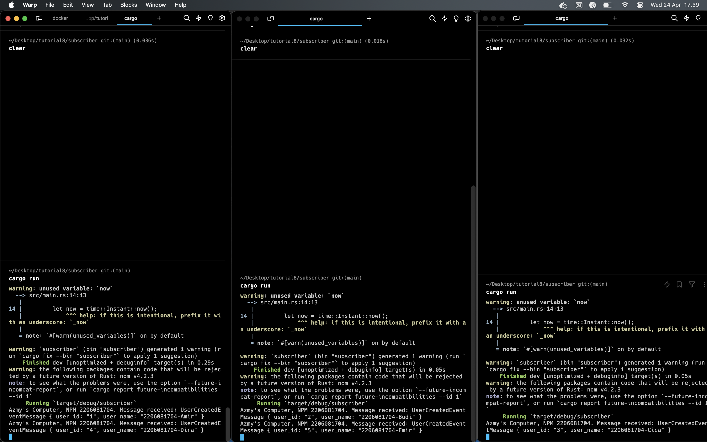

## Reflection

**a. what is AMQP?**

AMQP, which stands for Advanced Message Queuing Protocol, is an open standard protocol used in message-oriented middleware. This protocol allows various applications or parts of software to communicate by exchanging messages.

**b. what it means? guest:guest@localhost:5672 , what is the first guest, and what is the second guest, and what is localhost:5672 is for?**
- "guest" is the username used to authenticate with the AMQP server.
- The second "guest" refers to the password associated with the username.
- "localhost:5672" specifies the hostname and port of the AMQP server. "localhost" means the server is running on the local machine, and "5672" is the default port number used by AMQP for communication.

### RabbitMQ (Slow Subscriber)
I got 20 queues when I tried to run 4 times `cargo run` as publisher.

   .png)

### Running Three Subscribers
Each subscriber ended up handling different events because the tasks is splitted into 3 different subscribers.

   

On the graph below, theres noticeable difference compared to when there was only one subscriber active. The decrease in queued messages is a direct result of three subscribers now consuming messages concurrently making message consumption faster and more efficient.

   .png)
